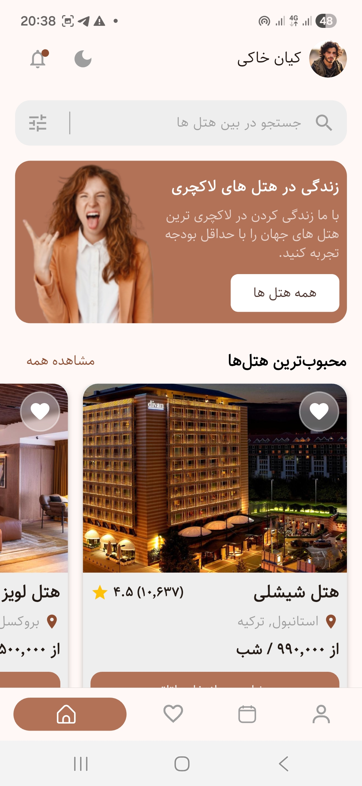
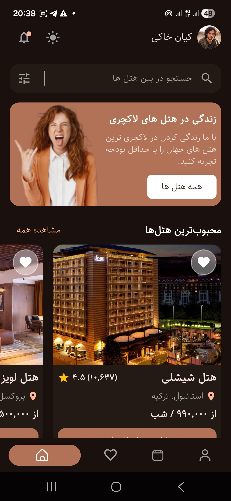

# hotelino

# 🏨 Hotelino  

> A modern Flutter hotel booking app built with **Clean Architecture**, **SOLID principles**, and a focus on **State Management**, **UI Design**, and **Best Practices**.

---

## 🧠 Covers
- 🧩 **SOLID Principles** – maintainable and scalable code structure  
- 🧱 **Clean Architecture** – separation of concerns across layers  
- 🔄 **State Management** – Provider / Riverpod / BLoC (based on your implementation)  
- 🎨 **UI/UX Design** – modern adaptive layouts and theme consistency  
- ✅ **Best Practices** – linting, folder organization, reusable widgets  

---

## 🚀 App Features
- 🏨 Hotel & accommodation listing  
- 🗺️ Interactive map with markers & tiles  
- 🖼️ Full-screen image viewer  
- 📅 Booking & calendar logic  
- 📱 Adaptive UI for mobile and web  
- 🔐 Ready for backend integration (API layer pre-configured)  

---

## 📸 Screenshots  
| onBoarding | Profile | dark Theme |
|:-------:|:----:|:--------:|
|  |  |  |

---
